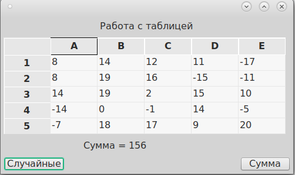
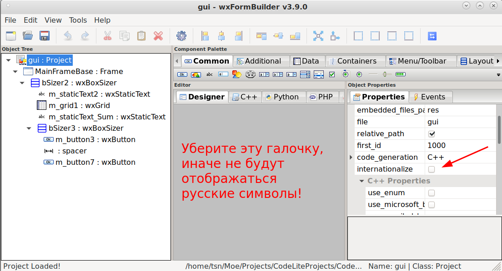

# CodeLite_Table_demo
Пример работы с таблицами wxWidgets на C++ в CodeLite (linux, debian)





```
// Случайные числа в таблицу
void MainFrame::onRand(wxCommandEvent& event)
{
    std::srand(time(0)); // Инициализация датчика случайных чисел
	int rc = m_grid1->GetNumberRows(); // Определяем количество строк в таблице
    int cc = m_grid1->GetNumberCols(); // Определяем количество столбцов в таблице
    // Перебираем все строки таблицы
    for(int i = 0; i < rc; i++) {
	// Перебираем все столбцы таблицы
	for(int j = 0; j < cc; j++) {
	    int r = std::rand() % 41 - 20; // Генерируем случайное число
	    m_grid1->SetCellValue(i, j, wxString::Format("%d", r)); // Занесем в ячейку таблицы нужное значение
	}
    }
    // Программно нажмем на кнопку расчета суммы
    onSum(event);
}

// Сумма чисел в таблице
void MainFrame::onSum(wxCommandEvent& event)
{
    int rc = m_grid1->GetNumberRows(); // Определяем количество строк в таблице
    int cc = m_grid1->GetNumberCols(); // Определяем количество столбцов в таблице
    int sum = 0;
    wxString ss;

    // Перебираем все строки таблицы
    for(int i = 0; i < rc; i++) {
	// Перебираем все столбцы таблицы
	for(int j = 0; j < cc; j++) {
	    ss = m_grid1->GetCellValue(i, j); // Считываем текстовое значение ячейки таблицы
	    sum += strtol(ss, NULL, 0); // Накапливаем в переменной значение суммы, преобразовав в число значение ячейки
	}
    }
    m_staticText_Sum->SetLabel(L"Сумма = " + wxString::Format("%d", sum)); // Выдадим в компонент значение суммы
}
```
